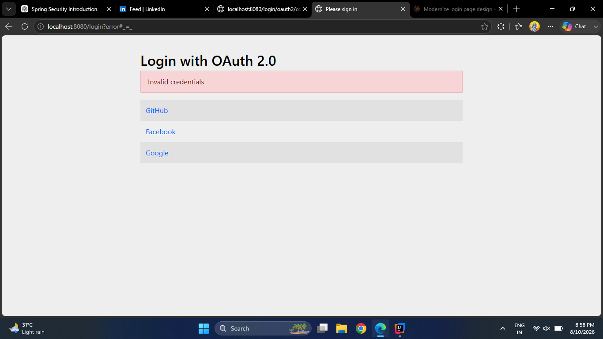
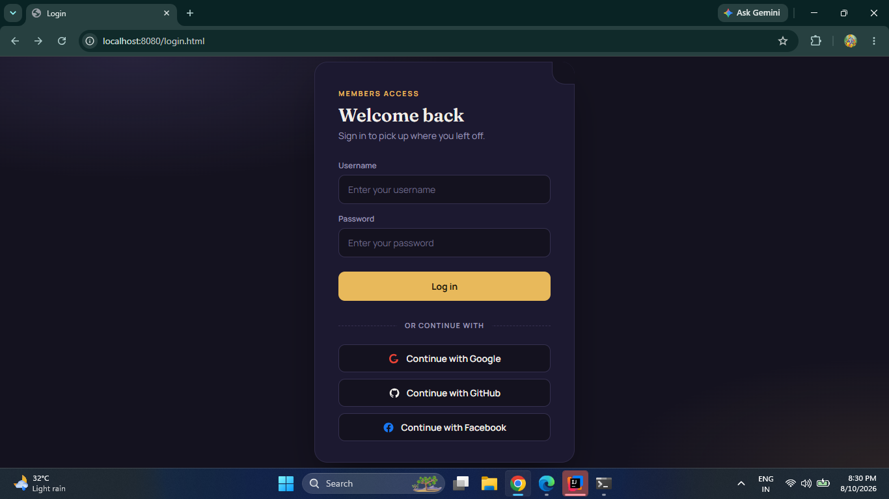
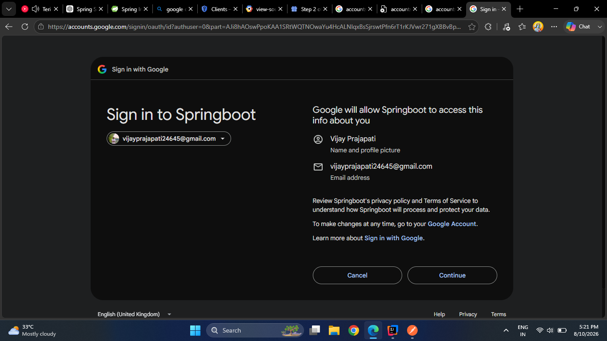
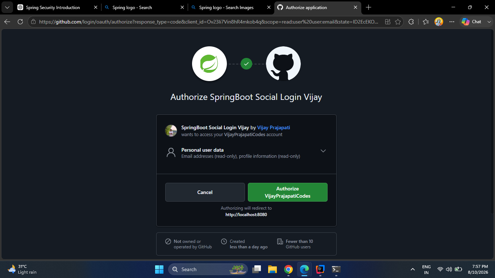
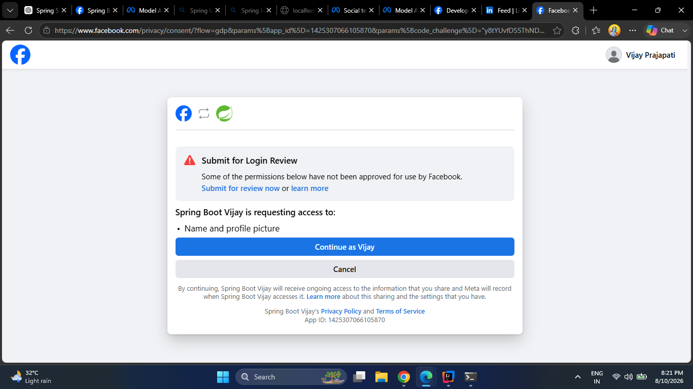

# 🔐 Spring Security Complete Guide

<p align="center">
  
  
  
  
  
  
</p>

<p align="center">
  <b>A practical, end-to-end Spring Security project covering authentication, authorization, JWT, refresh tokens, RBAC, method security, OAuth2, social login, CORS and CSRF.</b>
</p>

---

## 📌 About This Project

This repository is a **hands-on Spring Security learning and implementation project** built with Spring Boot.

The project covers Spring Security from fundamentals to advanced security concepts, including authentication, authorization, database authentication, JWT, refresh tokens, role-based access control, method security, OAuth2 social login, CORS and CSRF.

It also contains structured documentation, practical implementations, assignments, interview notes and authentication screenshots.

---

## 🚀 What I Implemented

### 🔑 Authentication

- Spring Security fundamentals
- In-Memory Authentication
- Database Authentication
- `UserDetails`
- `UserDetailsService`
- `AuthenticationManager`
- `PasswordEncoder`
- BCrypt password hashing

### 🎟️ JWT Authentication

- JWT generation
- JWT validation
- JWT claims
- Custom JWT authentication filter
- Bearer token authentication
- Stateless authentication
- `SecurityContextHolder`

### ♻️ Refresh Token

- Refresh token generation
- Refresh token persistence
- Refresh token expiration
- Access token regeneration
- Refresh token deletion/revocation

### 🛡️ Authorization

- Role-Based Access Control (RBAC)
- Role-based endpoint protection
- `hasRole()`
- `hasAnyRole()`
- Method-level security
- `@PreAuthorize`
- 401 vs 403 handling

### 🌐 OAuth2 & Social Login

- OAuth2 Login
- Google OAuth2
- GitHub OAuth2
- Facebook Login
- OAuth2 callback flow
- Social user authentication
- Social login integration

### 🌍 CORS

- Cross-Origin Resource Sharing
- Same-Origin vs Cross-Origin
- `CorsConfiguration`
- Allowed Origins
- Allowed Methods
- Allowed Headers
- React → Spring Boot CORS
- Preflight `OPTIONS` requests
- JWT Authorization header with CORS
- CORS debugging
- CORS vs Authentication
- CORS vs Authorization
- CORS vs CSRF

### 🛡️ CSRF

- Cross-Site Request Forgery
- CSRF attack flow
- CSRF tokens
- Cookie-based authentication
- Session-based authentication
- Spring Security CSRF protection
- `CookieCsrfTokenRepository`
- JWT + CSRF considerations
- Stateless JWT APIs
- `csrf.disable()`
- When CSRF should remain enabled
- CSRF vs CORS
- CSRF vs XSS
- CSRF debugging

---

## 🏗️ Authentication Architecture

```text
                         CLIENT
                           │
             ┌─────────────┴─────────────┐
             │                           │
      Username/Password              Social Login
             │                    Google/GitHub/Facebook
             │                           │
             ↓                           ↓
    AuthenticationManager             OAuth2
             │                           │
             └─────────────┬─────────────┘
                           ↓
                    Authentication
                           ↓
                  Generate JWT Tokens
                           │
                  ┌────────┴────────┐
                  ↓                 ↓
             Access Token      Refresh Token
                  │
                  ↓
          Protected API Request
                  │
                  ↓
      JwtAuthenticationFilter
                  │
                  ↓
            Validate JWT
                  │
                  ↓
         SecurityContextHolder
                  │
                  ↓
             Authorization
                  │
                  ↓
              Controller
```

---

## 🔄 JWT Authentication Flow

```text
Login Request
     ↓
AuthenticationManager
     ↓
UserDetailsService
     ↓
PasswordEncoder
     ↓
Authentication Success
     ↓
Generate Access Token
     ↓
Generate Refresh Token
     ↓
Return Tokens
```

For protected requests:

```text
Authorization: Bearer <JWT>
             ↓
JwtAuthenticationFilter
             ↓
Extract Token
             ↓
Validate Token
             ↓
Load UserDetails
             ↓
Create Authentication
             ↓
SecurityContextHolder
             ↓
Authorization
             ↓
Controller
```

---

## ♻️ Refresh Token Flow

```text
Access Token Expired
        ↓
Send Refresh Token
        ↓
Find Refresh Token
        ↓
Check Expiration
        ↓
Generate New Access Token
        ↓
Return New Access Token
```

---

## 🌍 OAuth2 Social Login Flow

```text
Application
     ↓
Google / GitHub / Facebook
     ↓
User Authentication
     ↓
Consent
     ↓
Authorization Code
     ↓
Spring Security OAuth2
     ↓
User Information
     ↓
Application Authentication
```

---

## 🗂️ Project Documentation

The `docs/` directory contains structured notes and practical learning material:

```text
docs/
├── 01_Introduction.md
├── 02_Architecture.md
├── 03_Security_Filter_Chain.md
├── 04_Authentication.md
├── 05_Authorization.md
├── 06_InMemory_User.md
├── 07_Database_Authentication.md
├── 08_UserDetailsService.md
├── 09_PasswordEncoder.md
├── 10_JWT.md
├── 11_Refresh_Token.md
├── 12_Role_Based_Access.md
├── 13_Method_Security.md
├── 14_OAuth2.md
├── 15_Social_Login.md
├── assignment.md
└── interview.md
```

---
## 📸 Authentication & Social Login Screenshots

### 🔐 OAuth2 Login



---

### 🌐 Social Login



---

### 🔵 Google OAuth2



---

### 🐙 GitHub OAuth2



---

### 🔷 Facebook OAuth2


## 🧰 Tech Stack

| Technology | Usage |
|---|---|
| Java | Application development |
| Spring Boot | Backend framework |
| Spring Security | Authentication & authorization |
| Spring Data JPA | Database persistence |
| Hibernate | ORM |
| MySQL | Database |
| JWT | Stateless authentication |
| OAuth2 | Social authentication |
| Lombok | Boilerplate reduction |
| Maven | Dependency management |
| IntelliJ IDEA | Development |

---

## 🔐 Security Concepts Covered

```text
Authentication
Authorization
Security Filter Chain
SecurityContextHolder
UserDetails
UserDetailsService
AuthenticationManager
PasswordEncoder
BCrypt
JWT
Access Token
Refresh Token
Bearer Authentication
Stateless Authentication
RBAC
Method Security
@PreAuthorize
OAuth2
Social Login
```

---

## 🧪 API Flow

### Register

```http
POST /api/users/register
```

### Login

```http
POST /api/users/login
```

### Refresh Access Token

```http
POST /api/users/refresh
```

### Logout

```http
POST /api/users/logout
```

### Protected Profile

```http
GET /api/users/profile
Authorization: Bearer <ACCESS_TOKEN>
```

---

## 🔗 OAuth2 Login Endpoints

```text
Google:
http://localhost:8080/oauth2/authorization/google

GitHub:
http://localhost:8080/oauth2/authorization/github

Facebook:
http://localhost:8080/oauth2/authorization/facebook
```

---

## 🎯 Learning Outcome

After completing this project, I gained practical understanding of:

- How Spring Security processes requests
- How authentication works internally
- How database users are authenticated
- How passwords are securely stored
- How JWT-based stateless authentication works
- How refresh tokens extend authentication sessions
- How roles and permissions protect APIs
- How method-level authorization works
- How OAuth2 authentication works
- How Google, GitHub and Facebook social login can be integrated into a Spring Boot application

---

## 📚 Why This Repository?

This repository is designed as both:

1. **A practical Spring Security implementation**
2. **A revision/interview reference**

The documentation, source code, assignments and screenshots are organized so that the complete security flow can be understood from fundamentals to advanced authentication.

---

## 👨‍💻 Author

**Vijay Prajapati**

Java Backend / Full Stack Developer

GitHub: [VijayPrajapatiCodes](https://github.com/VijayPrajapatiCodes)

---

## ⭐ If You Find This Useful

Feel free to explore the documentation, source code and authentication flows.

If this repository helps you learn Spring Security, consider giving it a ⭐.
